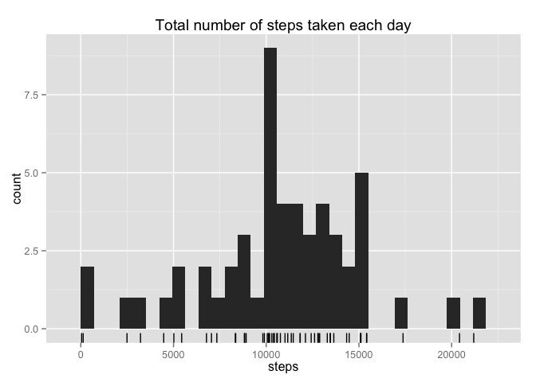
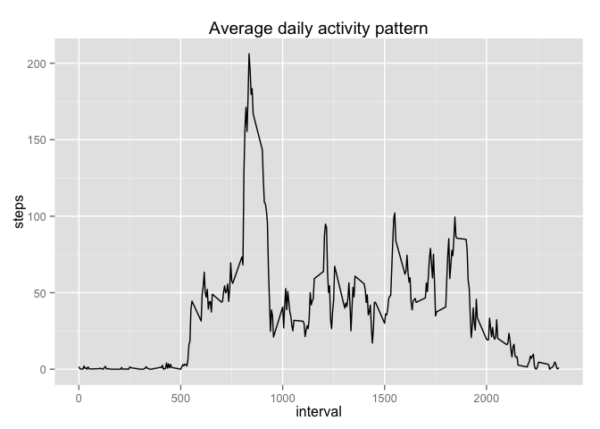
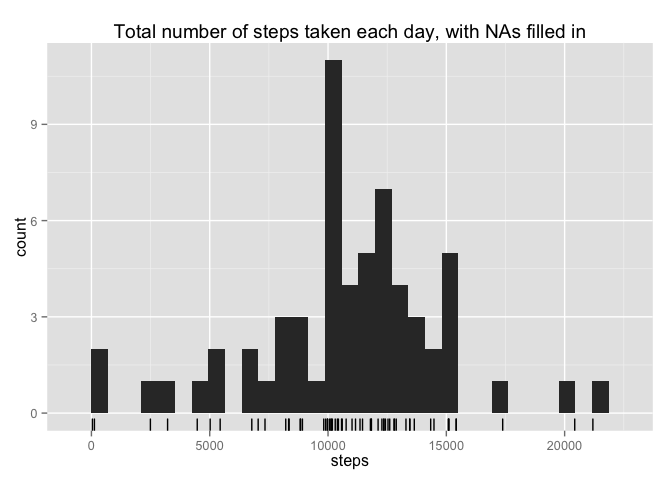
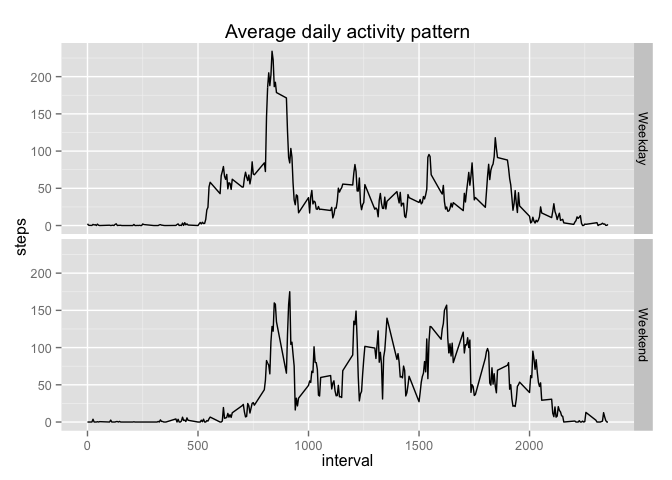

# Reproducible Research: Peer Assessment 1

## Loading and preprocessing the data

```r
library(dplyr)
```

```
## 
## Attaching package: 'dplyr'
## 
## The following object is masked from 'package:stats':
## 
##     filter
## 
## The following objects are masked from 'package:base':
## 
##     intersect, setdiff, setequal, union
```

```r
activity <- read.csv(unz("activity.zip", "activity.csv"))
activity <- mutate(activity, date = as.Date(date, "%Y-%m-%d"))
activity <- mutate(activity, weekday = weekdays(date))
```

## What is mean total number of steps taken per day?

```r
library(ggplot2)
summary <- group_by(activity, date) %>% summarise(steps = sum(steps))
qplot(data=summary , steps, geom = "histogram", 
      main = "Total number of steps taken each day") +
                   geom_rug() 
```

 


```r
step.mean <- mean(summary$steps, na.rm = TRUE)
step.median <- median(summary$steps, na.rm = TRUE)
step.mean
```

```
## [1] 10766.19
```

```r
step.median
```

```
## [1] 10765
```
For total number of steps taken per day:

 * *mean*: 10766.19 
 * *median*: 10765 

## What is the average daily activity pattern?

```r
average.day <- group_by(activity, interval) %>% summarise(steps = mean(steps, na.rm = TRUE))
qplot(data=average.day , interval, steps, geom = "line", 
      main = "Average daily activity pattern" ) 
```

 

```r
most.active.interval <- average.day$interval[which.max(average.day$steps)]
most.active.interval
```

```
## [1] 835
```

 On average across all the days in the dataset, the 5-minute interval
 with the maximum number of steps is 835.


## Imputing missing values

```r
# Count the number of NAs per column in the activity dataset
NAs <- sapply(activity, function (x) sum(is.na(x)))
NAs
```

```
##    steps     date interval  weekday 
##     2304        0        0        0
```

```r
# What percent is this?
sum(is.na(activity$steps)) / nrow(activity)
```

```
## [1] 0.1311475
```

I am going to fill in the missing value with the following strategy: If an missing value is encounctered,
then take the mean for that interval and weekday.


```r
# Work out the average steps per interval and weekday
interval.means <- group_by(activity, interval, weekday) %>% 
        summarise(mean.steps = mean(steps, na.rm = TRUE))

activity2 <- left_join(activity, interval.means, by = c("interval", "weekday")) %>% 
        mutate(steps = ifelse(is.na(steps), mean.steps, steps)) %>% 
        select(-mean.steps)
```

Look at the total number of steps taken each day again:


```r
summary2 <- group_by(activity2, date) %>% summarise(steps = sum(steps))
qplot(data=summary2 , steps, geom = "histogram", 
      main = "Total number of steps taken each day, with NAs filled in") +
                   geom_rug() 
```

 

```r
step.mean2 <- mean(summary2$steps, na.rm = TRUE)
step.median2 <- median(summary2$steps, na.rm = TRUE)
step.mean2
```

```
## [1] 10821.21
```

```r
step.median2
```

```
## [1] 11015
```

The mean increases by 0.51% and median increases by 2.32%. It is unsurpurprising that the mean changed so littled because I used a mean to work out the missing data.

## Are there differences in activity patterns between weekdays and weekends?


```r
activity <- mutate(activity, 
                   type = as.factor(
                           ifelse(weekday %in% c("Saturday", "Sunday"), 
                                  "Weekend", 
                                  "Weekday")
                           )
                   )

average.day2 <- group_by(activity, interval, type) %>% 
        summarise(steps = mean(steps, na.rm = TRUE))

qplot(data=average.day2 , interval, steps, geom = "line", 
      main = "Average daily activity pattern", facets = type ~ . ) 
```

 

Looking at the graph, the test subject would

1. Get up later on the weekends
2. Be active for longer in the evenings on weekend
3. Be active throughout the day on weekends
4. Be active first thing on a weekday, then spend the rest of the day at a desk.
